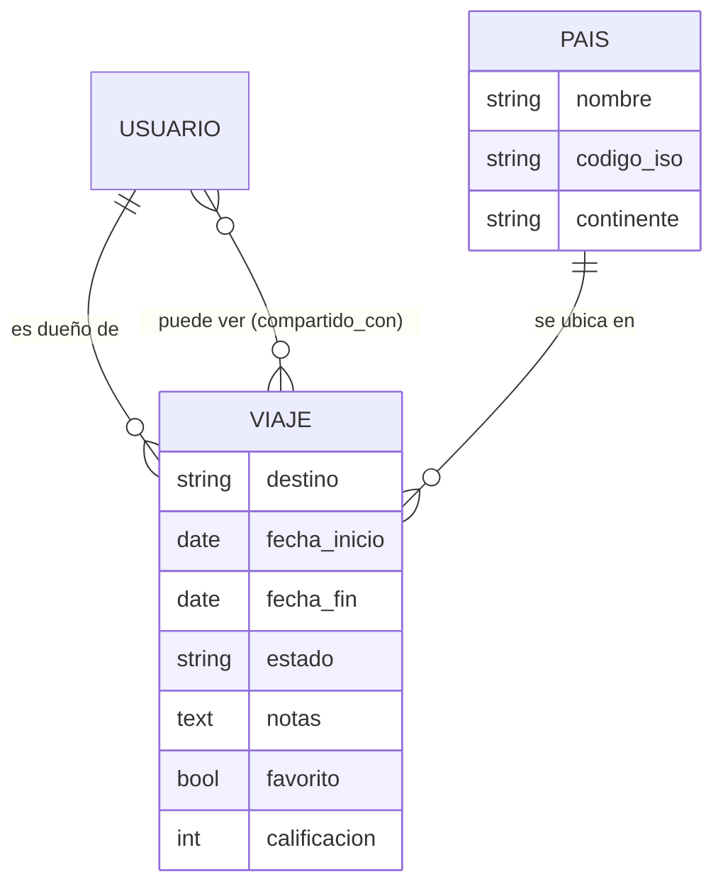

# ✈ Diario de Viajes

Aplicación web para documentar los viajes que ya hiciste, el que estás viviendo y los que planeas hacer.
Resuelve el **Caso 4: Diario de Viajes y Destinos Pendientes** de la asignatura Programación Back End (TI3V41).

> ¿Cuándo fui a Lima la última vez? ¿Cuáles viajes ya completé y cuáles están pendientes?
> Este diario responde esas preguntas con una línea de tiempo ordenada y con colores por estado.

| | |
|---|---|
| **Framework** | Django 5.2 LTS (soporte hasta abril de 2028) |
| **Base de datos** | SQLite (viene con Python, no hay que instalar nada) |
| **Lenguaje** | Python 3.10 o superior (probado con 3.12) |
| **Interfaz** | HTML + CSS propio (mobile-first, modo oscuro) + JavaScript mínimo, sin frameworks |
| **Pruebas** | 72 pruebas automáticas (`python manage.py test`) |

---

## Funcionalidades

**Lo que pide el caso**

- Registro de cada viaje con **destino** (ciudad o región), **país**, **fecha de inicio**, fecha de regreso y **estado**.
- **Línea de tiempo** ordenada del más reciente al más antiguo, agrupada por año y con paginación.
- Cada viaje muestra destino + país, fechas, **duración aproximada** y estado: completado ✓ / en progreso 🔄 / planificado 📋.
- Colores por estado: **gris** = pasado (completado), **azul** = presente (en progreso), **verde** = futuro (planificado).
- **Edición** de fechas, notas y estado, más un **cambio rápido de estado** con un botón.
- **Creación rápida** desde la web (solo 4 datos obligatorios; el resto es opcional y va plegado).
- **Compartir con tu pareja**: eliges qué viajes puede ver (solo lectura). Al escribir 2 letras («ad») aparecen
  las personas cuyo usuario o nombre empieza así; eliges con el mouse o el teclado y cada una queda como ficha.
- Respuesta inmediata a **«¿cuáles completé?» y «¿cuáles están pendientes?»** con los contadores y filtros de la línea de tiempo.

**Además**

- El sitio **avisa cuando un estado quedó desfasado** (por ejemplo, un viaje planificado que ya comenzó)
  y lo corrige con un clic.
- **Diseño cuidado**: mobile-first, navegación inferior en teléfonos, modo oscuro automático
  y banderas que se ven bien también en Windows.

---

## Instalación en Windows (VS Code)

> Todos los comandos se escriben en la terminal de VS Code (`Ctrl + ñ`), dentro de la carpeta del proyecto.

```powershell
# 1. Crear y activar el entorno virtual
py -m venv .venv
.venv\Scripts\activate
# Si PowerShell bloquea la activación, ejecuta una sola vez:
#   Set-ExecutionPolicy -Scope CurrentUser RemoteSigned

# 2. Instalar las dependencias
pip install -r requirements.txt

# 3. Crear las tablas (también carga los 203 países)
python manage.py migrate

# 4. Crear tu superusuario para el admin
python manage.py createsuperuser

# 5. (Opcional) Cargar datos de demostración: usuarios «viajero» y «pareja»
python manage.py cargar_demo

# 6. Iniciar el servidor
python manage.py runserver
```

Abre <http://127.0.0.1:8000/> para el sitio y <http://127.0.0.1:8000/admin/> para el panel de administración.
Los usuarios de demostración usan la contraseña `Viajes.2026`.

En macOS o Linux los comandos son iguales salvo: `python3 -m venv .venv` y `source .venv/bin/activate`.

---

## Comandos útiles

| Comando | Para qué sirve |
|---|---|
| `python manage.py verificar_bd` | Comprueba la conexión: motor, versión, latencia, migraciones y cantidad de registros. |
| `python manage.py cargar_demo` | Crea los usuarios `viajero` y `pareja` con viajes de ejemplo (algunos compartidos). |
| `python manage.py cargar_demo --reiniciar` | Borra y vuelve a crear los datos de demostración. |
| `python manage.py test` | Ejecuta las 72 pruebas automáticas (en una base temporal, sin tocar tus datos). |
| `python manage.py check --deploy` | Revisa la configuración de seguridad para producción. |
| `GET /salud/` | Estado del servicio y de la base de datos en JSON. |

---

## Modelo de datos

2 tablas propias + 1 tabla intermedia (muchos a muchos) + las tablas de usuarios de Django.



**Reglas protegidas en dos niveles** (validación en Python + restricción en la base de datos):

- La fecha de regreso no puede ser anterior a la de inicio.
- La calificación va de 1 a 5 y solo se puede calificar un viaje que ya comenzó.
- Solo puede haber **un viaje en progreso** por usuario.
- El estado debe ser coherente con las fechas (un viaje completado no puede estar en el futuro, etc.).

---

## Seguridad

| Tema | Cómo se resolvió |
|---|---|
| **Secretos** | La clave secreta no está escrita en el código: se lee de la variable de entorno `SECRET_KEY` (en desarrollo se genera una temporal al iniciar, y con `DEBUG=False` es obligatoria). |
| **Autenticación** | Login, registro, cambio de contraseña y logout **solo por POST**. `LoginRequiredMiddleware` exige sesión en todo el sitio salvo las páginas públicas. |
| **Permisos** | Cada consulta se filtra por el usuario conectado: el viaje de otra persona responde 404. Los compartidos son solo lectura. Crear, editar y eliminar exige los permisos de Django del grupo «Viajeros». En el admin, el staff que no es superusuario solo ve lo suyo. |
| **CSRF** | Token en todos los formularios, cookie `HttpOnly` + `SameSite=Strict`, página de error clara y validación de redirecciones (`url_has_allowed_host_and_scheme`). |
| **Validación y sanitización** | Validación de tipo (formularios), de contenido (reglas del negocio en los modelos) y restricciones en la base. El texto se limpia de HTML y caracteres invisibles antes de guardarse; las plantillas además escapan todo al mostrarlo. |
| **Inyección SQL** | Solo se usa el ORM de Django (sin SQL armado a mano): todas las consultas son parametrizadas, así los datos del usuario nunca se mezclan con el SQL. |
| **Cabeceras HTTP** | Content-Security-Policy estricta (sin scripts en línea), `X-Frame-Options: DENY`, `nosniff`, `Referrer-Policy` y `Permissions-Policy`. HTTPS, HSTS y cookies seguras automáticas con `DEBUG=False`. |
| **Buscador de personas** | Al compartir, las sugerencias exigen sesión y permiso, piden al menos 2 letras, muestran como máximo 8 personas y nunca entregan correos. Los nombres se dibujan como texto (nunca como HTML). |

---

## Cómo cumple la rúbrica

| Criterio | Dónde revisarlo |
|---|---|
| Config `models.py` con relaciones avanzadas | `viajes/models.py`: ForeignKey, ManyToMany, `QuerySet` propio, índices, `CheckConstraint`, `UniqueConstraint` condicional, `clean()` |
| Migraciones + limpieza | `viajes/migrations/`: una migración inicial ordenada y una de datos reversible (países). Una prueba falla si falta alguna migración. |
| Conexión activa verificada y validada | `python manage.py verificar_bd`, la ruta `/salud/` y el estado de la conexión en el inicio del admin |
| Admin con `list_display`, `list_filter`, búsqueda | `viajes/admin.py`: columnas personalizadas, filtros propios, facetas, búsqueda, acciones masivas y exportación a CSV |
| CREATE con validación completa | `viajes/views/crear.py` + `ViajeForm` + `Viaje.clean()` |
| READ ordenado y paginado | `viajes/views/lectura.py`: orden por fecha, filtros validados, paginación tolerante a errores |
| UPDATE con precarga, validación y permisos | `viajes/views/editar.py`: edición y cambio rápido de estado (solo el dueño; los demás reciben 404) |
| DELETE con confirmación y mensajes | `viajes/views/eliminar.py`: página de confirmación que detalla lo que se borra y mensaje final |
| Manejo de errores con mensajes claros | `GuardadoSeguroMixin` (`viajes/mixins.py`), páginas 400/403/404/500/CSRF propias y mensajes en cada acción |
| Autenticación + logout | `cuentas/` |
| Permisos lectura + edición + admin | Filtros por dueño, compartidos de solo lectura, permisos de grupo y admin restringido |
| CSRF, validación, inyección SQL | Ver la sección **Seguridad** |
| Responsive, moderno y usable | `static/css/app.css`: mobile-first, navegación inferior en teléfonos, modo oscuro, accesible |

---

## Estructura del proyecto

```text
diario-de-viajes/
├── config/              Configuración: settings.py, urls.py, wsgi/asgi
├── core/                Piezas compartidas: seguridad (CSP), formularios, sanitización,
│                        diagnóstico de BD, páginas de error y comando verificar_bd
├── cuentas/             Registro, inicio/cierre de sesión, perfil, contraseña
│                        y buscador de personas para compartir
├── viajes/              La app principal
│   ├── models.py        Pais, Viaje
│   ├── forms.py         Formularios con validación y sanitización
│   ├── views/           Vistas separadas por operación: lectura.py (READ), crear.py (CREATE),
│   │                    editar.py (UPDATE) y eliminar.py (DELETE)
│   ├── mixins.py        Permisos, guardado seguro y paginación reutilizables
│   ├── admin.py         Admin de viajes y países
│   ├── management/      Comando cargar_demo
│   ├── migrations/      Migraciones (esquema + países)
│   └── tests/           Pruebas automáticas
├── templates/           Plantillas HTML (base, parciales, formularios, errores, admin)
├── static/              CSS, JavaScript (app.js, buscador-usuarios.js),
│                        íconos SVG, fondo topográfico y fuente de banderas
└── requirements.txt     Dependencias
```

---

## Cómo agregar funcionalidades en el futuro

El proyecto está pensado para crecer sin romper lo existente:

- **Nuevo dato de un viaje** (por ejemplo, «medio de transporte»): agrégalo en `Viaje` (`viajes/models.py`),
  súmalo a `ViajeForm.Meta.fields`, ejecuta `python manage.py makemigrations` y `migrate`, y muéstralo en la plantilla.
- **Nuevo registro de un viaje** (por ejemplo, lugares favoritos): crea un modelo con `ForeignKey` a `Viaje`
  y reutiliza los mixins de `viajes/mixins.py` para que solo el dueño pueda verlo y editarlo.
- **Nueva app** (por ejemplo, una API): `python manage.py startapp nombre`, agrégala a `INSTALLED_APPS` e incluye sus rutas en `config/urls.py`.
- Antes de subir cambios, ejecuta `python manage.py test`: si algo se rompió, las pruebas lo dirán.

---

## Créditos

- Banderas: fuente «Twemoji Country Flags» de [country-flag-emoji-polyfill](https://github.com/talkjs/country-flag-emoji-polyfill)
  (código MIT), con arte de [Twemoji](https://github.com/twitter/twemoji) bajo licencia
  [CC-BY 4.0](https://creativecommons.org/licenses/by/4.0/). Archivo: `static/fonts/banderas.woff2` (sin modificaciones).
- Íconos, fondo topográfico e ilustraciones: creados para este proyecto.

## Autor

Benjamín Ortiz · Programación Back End (TI3V41) · INACAP · 2026

<!-- Agrega aquí a los demás integrantes del grupo, si corresponde. -->
